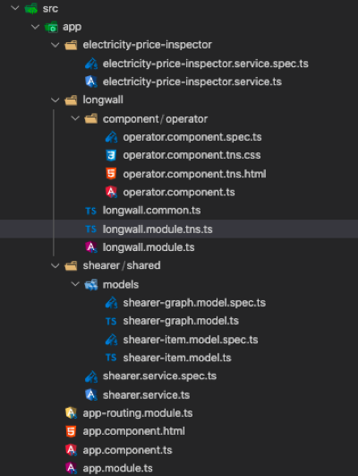

<h2>Description</h2>
This is a mobile application for longwall operators to view real time updates of shearer’s location in longwall mining using a line graph displayed on the mobile device. It contains features such as identification and indication of, stale shearer location data, and electricity price. 
  
Network conditions underground can be unstable so this app will let the longwall operator know that the received location data is stale or not. When the electricity price spikes, it will determine which is the closest gate for shearer to stop at and indicate to the user of this event. Once electricity price stabilises, shearer will resume operation two minutes later. 
 

<h2>Specification</h2>
<strong>Program Stack:</strong> 
Angular with Nativescript. The specific versions are all listed in the root package.json file.  

<strong>Program Structure:</strong> 
 
There are 3 main entities in this mobile app 
1. Longwall 
2. Shearer 
3. Electricity price inspector 

<strong>(Longwall -> Component -> Operator)</strong> 
Operator will subscribe to shearer’s service observable to mock shearer sending location data. It also contains the logic of dealing with the location data as well, such as determining if it is stale by calculating the difference between the packet number (global index) of received location data and the last item’s packet number in array.  
An observable array is used to store the location of shearer. Every time operator received a location, it will push it into the array along with its appropriate metadata stored in shearer Graph mode, such as time stamp, staleness, location, global index, stale location data.  
In the HTML, it will contain two line graph, where one plots based on the location and the other one plots the stale locations, so that we are able to indicate to user of the stale data. The live electricity price will be shown in the above the graph where if in case of an electricity spike, the text color will turn from green to red. In case of an electricity spike, the nearest gate will be indicated and once price stabilises, the resume operation time for shearer will also be shown. 

<strong>(Shearer -> shared)</strong> 
This is the service that will send location data to its subscribers. It works by simulating the shearer by having a setInterval function, sending location data every 2 seconds. The shearer will oscillate between main gate and tail gate, between 0 and 100, respectively. 
Shearer service will generate random positions to simulate unstable network. The default number of network outages in one full mining cycle is 10. For every cycle, new random positions of network outages will be generated. 
Shearer service subscribes to Electricity price inspector service to receive news of electricity spike. In case of electricity spike, shearer service will determine the closest gate to stop at in accordance to its current position. When it reaches the closes gate (stopGate), it will set a Boolean variable (reachStopGate) to lock the execution flow from executing any logic that is related to shearer moving. Once the price stabilises, it will start a timer for 2 minutes before setting the boolean variable (reachStopGate) to allow shearer start mining again.   

<strong>(Electricity-price-inspector)</strong> 
This is the service that will mock the real electricity price and also price spikes. The spike has been pre-set to happen every 10 minutes. There will be a setInterval function that will random the electricity price every 2 seconds. When 10 minutes is up, it will trigger a spike event and let all its subscribers know that there has been a spike. The spike duration is random and has a max range of 1 to 75 seconds. This spike duration will be used to set a timeout, where the callback function will be to let all its subscribers know that price has stabilised. 

<h2>External links</h2>
Thought process model: https://1drv.ms/u/s!AvaeW0_vt-YNhqJJBgumyU_hmhVdmQ?e=E7FQVs 
